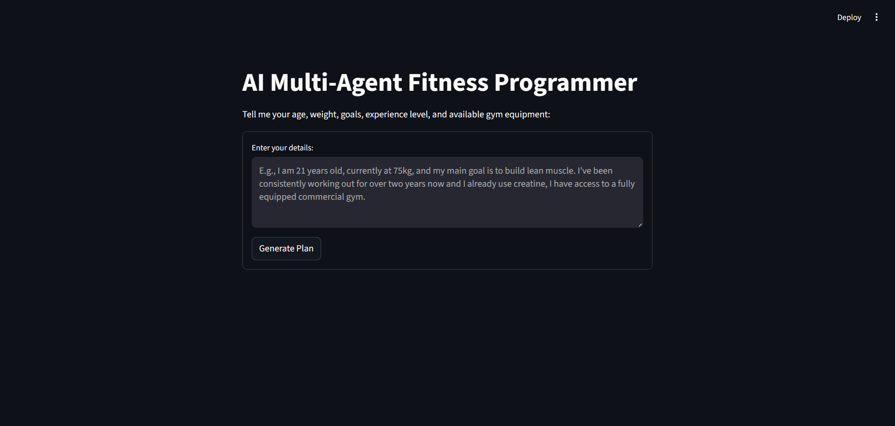

#  AI Multi-Agent Fitness & Nutrition Programmer

An intelligent, multi-agent generative AI application that designs highly customized, multi-week fitness and nutrition plans. Built with **LangGraph**, **LangChain**, and **Streamlit**, this project demonstrates complex state management and sequential reasoning using specialized AI agents.

##  Overview

Instead of a standard single-prompt chatbot, this application utilizes a **Multi-Agent State Graph** architecture. A user provides a single, natural-language prompt containing their biometrics, experience level, and available gym equipment. The system then passes this unstructured data through four specialized AI agents to extract, process, and format a comprehensive plan.

##  App Showcase

**1. The User Intake UI**
*(Shows the simple, natural-language input)*


##  The Multi-Agent Architecture (LangGraph Flow)

The application relies on a shared `GraphState` that accumulates data as it passes through the following sequential nodes:

1. **Agent 1: The Intake Assessor (Structured Output)**
   - **Role:** Reads unstructured human language and extracts precise data.
   - **Tech:** Uses `gemini-2.5-flash` bound to a **Pydantic** schema (`UserIntakeData`) to guarantee strict JSON formatting of age, weight, goals, experience, and equipment.
2. **Agent 2: The Routine Architect**
   - **Role:** Acts as an elite fitness programmer.
   - **Action:** Generates a weekly workout split constrained *strictly* by the user's experience level and available equipment.
3. **Agent 3: The Nutrition Advisor**
   - **Role:** Sports nutritionist.
   - **Action:** Analyzes both the user's biometrics and the newly generated workout routine to calculate calorie targets, macronutrient splits, and specific supplement protocols (e.g., creatine phasing).
4. **Agent 4: The Report Generator**
   - **Role:** Document formatter.
   - **Action:** Compiles all accumulated state data into a highly readable, motivating Markdown document.

##  Tech Stack

* **UI Framework:** [Streamlit](https://streamlit.io/)
* **AI Orchestration:** [LangGraph](https://python.langchain.com/v0.1/docs/langgraph/) & [LangChain](https://www.langchain.com/)
* **LLM Provider:** [Google Gemini](https://ai.google.dev/) (Using `gemini-2.5-flash` for high-speed, multimodal reasoning)
* **Data Validation:** [Pydantic](https://docs.pydantic.dev/)
* **Environment Management:** `python-dotenv`

##  Installation & Setup

**1. Clone the repository**
```bash
git clone [https://github.com/yourusername/ai-fitness-programmer.git](https://github.com/yourusername/ai-fitness-programmer.git)
cd ai-fitness-programmer
```

**2. Create a virtual environment**
```bash
python -m venv venv
source venv/bin/activate  # On Windows use `venv\Scripts\activate`
```

**3. Install dependencies**
```bash
pip install streamlit langgraph langchain-core langchain-groq pydantic python-dotenv
```

**4. Set up Environment Variables**
Create a .env file in the root directory and add your Gemini API key:
```bash
GOOGLE_API_KEY=your_api_key_here
```

**5. Run the Streamlit application:**
```bash
streamlit run main.py
```

 Author
Mohammad Taqreem Khan